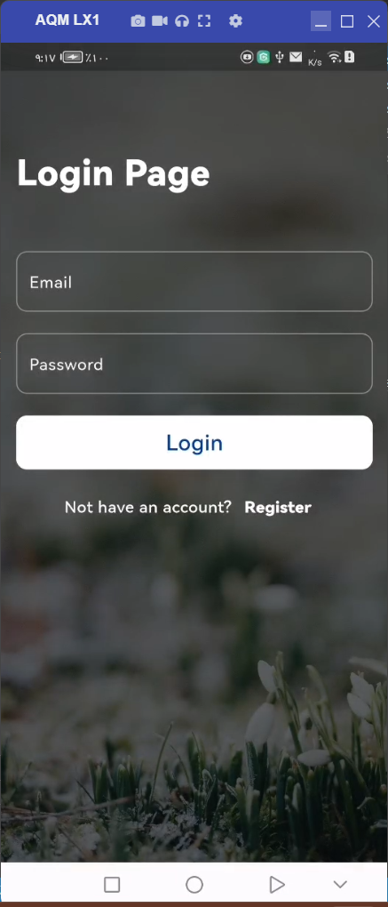
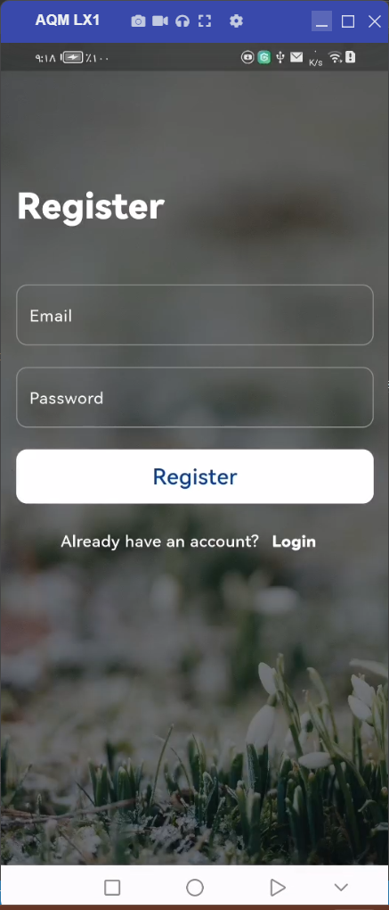
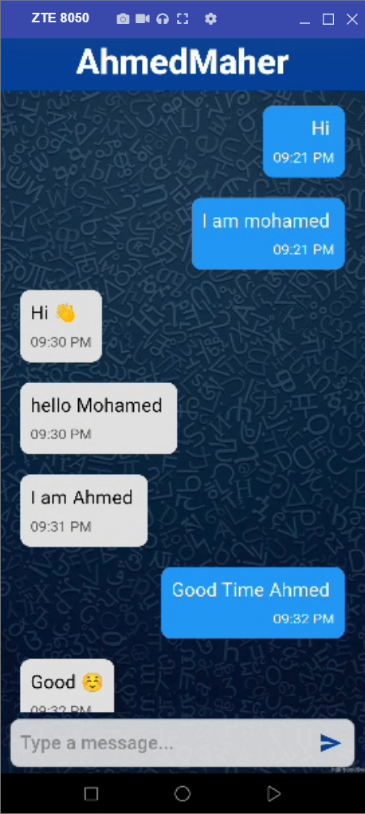
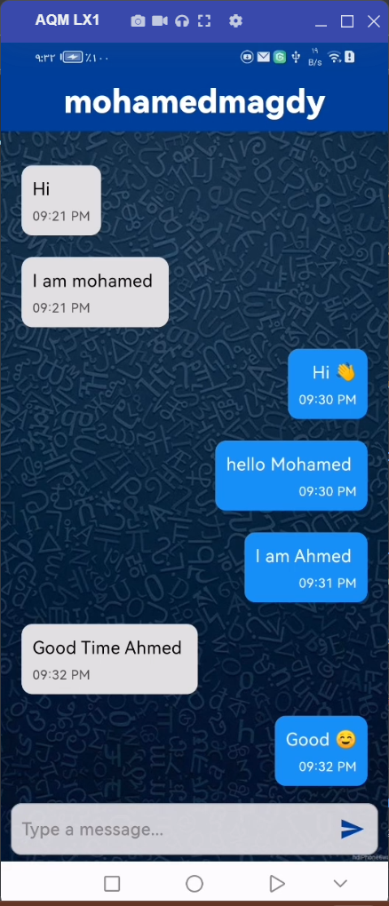

<br clear="both">
<a href="https://git.io/typing-svg"></a>
<br clear="both">

[](https://flutter.dev/)
[](https://opensource.org/licenses/MIT)

## Overview

**Chaty App** is a real-time chat application built using modern web technologies. It supports instant messaging, user authentication, and has a sleek, responsive design. Whether you're looking to build a personal chat app or an enterprise-grade messaging platform, this project serves as a solid foundation.

## Features

- User Registration
- User Login
- Real-time Chat
- Firebase Firestore for data storage
- Firebase Authentication

## Screens

- **Login Page**: Allows users to log in with their email and password.
  


- **Register Page**: New users can create an account.
  


- **Chat Page**: Users can send and receive messages in real-time.

 

## Project Structure

```bash
lib/
├── Screens/
│   ├── chat_page.dart        # Screen for real-time chat functionality
│   ├── login_page.dart       # Screen for logging in
│   └── register_page.dart    # Screen for new user registration
├── firebase_options.dart     # Firebase configuration for different platforms
├── main.dart                 # Entry point for the application
assets/
    └── chat-bubble.png       # App icon
```

## Installation

### Prerequisites

- Flutter SDK
- Firebase project with Firestore and Authentication enabled
- Dart SDK

### Steps

1. Clone the repository:
    ```bash
    git clone https://github.com/your-username/chat_app.git
    cd chat_app
    ```

2. Install dependencies:
    ```bash
    flutter pub get
    ```

3. Set up Firebase:
    - Follow [Firebase's setup guide for Flutter](https://firebase.flutter.dev/docs/overview) to add your Firebase project to the app.
    - Replace the `firebase_options.dart` with your own configurations.

4. Run the app:
    ```bash
    flutter run
    ```

## Firebase Setup

Ensure that you have Firebase Authentication and Firestore enabled for the app to work properly. You can modify the Firebase project settings in the `firebase_options.dart` file.

## Generating App Icons

The app uses a custom icon for the launcher. To generate the icons for both Android and iOS, run:

```bash
dart run flutter_launcher_icons -f pubspec.yaml
```

Ensure the image is located at `assets/chat-bubble.png` before running the command.

## Dependencies

- **Flutter**: The core framework for the app.
- **Firebase Core**: Initialize Firebase in the app.
- **Firebase Auth**: Authentication using email and password.
- **Cloud Firestore**: Real-time database to store chat messages.
- **flutter_launcher_icons**: For generating app launcher icons.

## Contributing

Contributions are welcome! Feel free to submit a Pull Request with improvements, bug fixes, or new features.

1. Fork the repository.
2. Create a new branch (`git checkout -b feature/my-feature`).
3. Make your changes and commit (`git commit -am 'Add new feature'`).
4. Push to the branch (`git push origin feature/my-feature`).
5. Create a new Pull Request.

## Congratulations

You’ve successfully integrated Chat App into your Flutter app! For more advanced features and customization options.

If you found this guide helpful, don’t forget to ⭐ star this repository on GitHub to show your support!

Thank you for reading!

## Contact

For any questions or inquiries, feel free to reach out:

- **GitHub:** [mohamedmagdy2301](https://github.com/mohamedmagdy2301)
- **Email:** [mohammedmego15@gmail.com](mohammedmego15@gmail.com)

## License

This project is licensed under the MIT License - see the [LICENSE](LICENSE) file for details.
